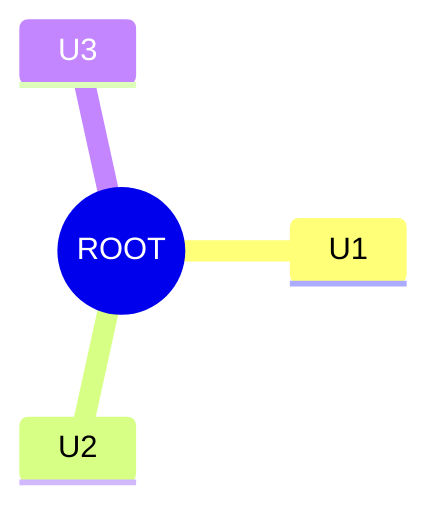
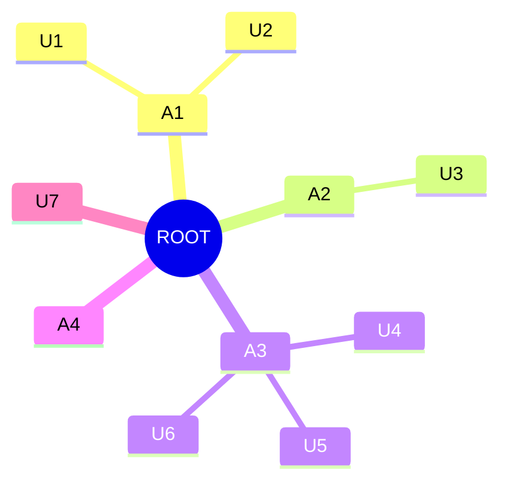

<h1 align = "center">pOrgz</h1>

[**pOrgz**](https://github.com/pOrgz-dev) is a cross-platform, AI/ML-enabled open-source, modern, secure financial application to analyze, monitor, and track expenses at an individual, group, or organization level.
The application is built for people with extremely high secure personal data management demands and can be used in Windows, macOS, and Linux systems.
It saves different types of information like account details, account owner, and financial transactions which can be managed/edited/updated by an administrator or a privileged user.

## Quick Start Guide

The application is currently in development phase, and people with a background of coding knowledge are preferred to test the application. The quick start guide is yet in the development phase and will be released with the first project release.

### User Management System (UMS)

The application can be either used by an individual, or can be used by a group/organization. To facilitate this, a user management system is developed which is controlled and maintained seperately than the accounts management system. Each session has a super administrator (`root`) who by default has all the access, while one/multiple administrators, and users can be defined. Secondary administrators also has the facility to create their own users and can leverage permissions.

At an individual level, a single user (i.e., `root`) is can control, understand, analyze and modify the table. When a individual is responsible to manage more than one user he has the option to either create seperate users (`U1`, `U2`, ..., `Un`) under him, or may also assign a *"group"* to check combined information. Typically, at an individual level, the session can be structured as:

However, at an organization level different admins (`A1`, `A2`, ..., `An`) can be assigned who can seperately create their own users, and does not have sharing privileges. A typical architecture can be like:

Any of the above mentioned entities (i.e., `root`, `admins` or `users`) can have one/more accounts mapped to them. Permissions to view/edit the information is by default provided to `root` while `admins` are added to `sudoers` by `root` (as in `*nix` systems). Finally, an `user` can be assigned functionalities by either `root` or `admins` which has top-to-bottom approach.

### Accounts Management System (AMS)

Accounts are the core of the financial management tool. An account is identified by an unique identity number generated seperately in the system and is referenced in all the columns. Considering Indian household scenarios, the following types of accounts can be currently tracked in the system:
  1. Savings Account (`DEBIT`)
  2. Credit Cards Account (`CREDIT`)
  3. Wallet Accounts (like Amazon Pay, Uber Wallet | `WALLET`)
  4. DEMAT Account (`DEMAT`)
  5. Provident Funds Account (`PPF`)
  6. National Pensions Scheme (`NPS`)

## Contribution

We are always looking for suggestions to improve the services, and to include new features into the application. The application is primarily developed in [`python`](https://www.python.org/) and [`SQLite`](https://sqlite.org/index.html) is considered the default database.

